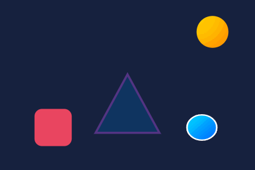

# rive-mcp

[English README is here](./README.md)

エディタ不要・完全無料・ローカル完結の Rive (`.riv`) MCP サーバー。


<p align="center"></p>
<p align="center"><i>このアニメーションは <code>riv_create</code> だけで生成（Riveエディタ不使用）</i></p>

Claude（や任意の MCP クライアント）から `.riv` アニメーションファイルの
**解析・レンダリング・State Machine 実行・統合コード生成** ができる。

公式 Rive MCP（エディタ常駐が前提）や有料のサードパーティ MCP と違い、
`.riv` ファイルさえあれば動く。レンダリングには公式 Rive ランタイム
（`@rive-app/canvas-advanced` WASM）を headless Chromium 内で駆動するため、
描画忠実度はエディタ・本番ランタイムと同一。

## セットアップ

npm からインストール:

```bash
npm install -g rive-mcp-server

# Claude Code に登録（ユーザースコープ = 全プロジェクトで利用可）
claude mcp add --scope user rive -- rive-mcp
```

またはソースから:

```bash
npm install
npm run build
claude mcp add --scope user rive -- node D:/01.projects/rive-mcp/dist/index.js
```

ブラウザは以下の順で自動検出される（インストール不要のことが多い）:

1. 環境変数 `RIVE_MCP_CHROME`（Chrome/Edge 実行ファイルパス）
2. Playwright キャッシュ（`%LOCALAPPDATA%\ms-playwright\chromium-*`）
3. インストール済み Chrome → Edge

## ツール一覧

| ツール | 機能 |
|---|---|
| `riv_list` | ディレクトリ配下の `.riv` を再帰検索（サイズ・フォーマット版） |
| `riv_inspect` | アートボード / アニメーション（duration・fps・loop）/ State Machine と入力（型・初期値）の全メタデータ抽出 |
| `riv_render_frame` | 任意時刻の1フレームを PNG レンダリング（インライン画像 + ファイル保存） |
| `riv_render_gif` | アニメーションをプレビュー GIF に変換 |
| `riv_play_state_machine` | 入力の set / fire → advance → 状態遷移レポート（+任意でフレームキャプチャ）|
| `riv_generate_code` | 実在の artboard / state machine / input 名を埋め込んだ統合コード生成（react / js / vue / svelte / flutter） |
| `riv_create` | **JSONシーン仕様から .riv を生成**（エディタ不要）。シェイプ（rect/ellipse/polygon）、単色/グラデ塗り、ストローク、**PNG画像埋め込み**、**グループ階層（リグ）**、**メッシュ変形（頂点アニメーション）**、キーフレームアニメーション（イージング付き）、State Machine（入力・状態・条件付き遷移・exit time）。生成後に公式ランタイムで自動検証しプレビュー画像を返す |
| `riv_dump` | .riv バイナリの低レベル構造ダンプ（typeKey / プロパティ / 階層）。フォーマット調査・デバッグ用 |
| `riv_slice_image` | キャラクターPNGをポリゴン領域でパーツ切り出し（カットアウトリグ用）。各パーツPNG + 消去済みbase + 配置情報を出力 |
| `riv_edit` | 既存.rivの**無損失編集**: 任意プロパティ変更・名前付きテキスト差し替え・オブジェクト削除（サブツリー+参照自動再マップ）。roundtripはvehicles.rivでピクセル完全一致を検証済み |
| `riv_rig_character` | **キャラPNG1枚→完成リグをワンコール生成**: パーツ切り出し+2ボーン頭メッシュ+目パチ+idle/happyアニメ+SM |
| `riv_diff` | 2つの.rivの構造差分（型数変化・オブジェクト単位のプロパティ差分） |
| `riv_studio` | **ローカルWebスタジオ**（公式エディタ風3ペイン・日英UI）: 階層ツリー / キャンバス上のクリック選択・ドラッグ移動 / インスペクタ（位置・サイズ・回転・色・テキストを直接編集→即反映）/ タイムライン（キーフレーム表示・クリックでシーク）/ ライブプレビュー+ホットリロード / SM入力コントロール自動生成 / シーンJSON編集→再ビルド / PNGスナップショット。scenePath 無しでも .riv を生プロパティ単位で直接編集可能 |
| `riv_studio_notes` | **スタジオUI→AIへの指示の受信**: UIの「AIへの指示」ボックスに人間が書いた修正依頼をAIが取得（取得するとUI側に通知）。「スタジオの指示を確認して」で呼ばれる |

## キャラクターアニメーション

1枚絵のキャラクターPNGから「自然に動く」.riv を生成できる:

- `images[].pngPath` — PNG を .riv に埋め込み（ImageAsset + FileAssetContents）
- `groups` — Node 階層。ピボット・親子関係でリグを構成
- `images[].mesh: {columns, rows}` — 自動グリッドメッシュ。頂点は `"<imageId>#v<行>_<列>"` で
  キーフレーム対象にでき、行別ウェイトで首かしげ・呼吸などの自然な変形が可能
- `bones` — ボーンチェーン（RootBone/Bone）。`mesh.bones` でスキニング（距離ベース自動ウェイト）、
  ボーン回転キーフレームで滑らかな「しなり」。グループ/シェイプ/画像はボーンに剛体アタッチも可
- **推奨ワークフロー（カットアウト）**: `riv_slice_image` で耳・尻尾等を切り出し →
  パーツをピボットグループに配置 → 頭の傾きは2ボーンスキンメッシュ → 目パチはベクターまぶたoverlay
- 実例: `test/koneko-parts-demo.mjs`（実絵柄パーツリグ）/ `test/koneko-vector-demo.mjs`（ベクター再構築）/
  `test/bones-demo.mjs`（ボーン曲げ）/ `test/uchinoko-demo.mjs`（1枚絵メッシュ）

## 対応機能（riv_create シーン仕様）

- **描画**: rect(角丸)/ellipse/polygon、単色・線形/放射グラデ、ストローク、統一z順序、PNG画像
- **テキスト**: フォント埋め込み（既定: 同梱Inter/OFL）、スタイル付きラン（サイズ・色）、名前付きランはランタイム差し替え可
- **構造**: 複数アートボード、ネストアートボード（SM入力自動公開）、グループ階層、ボーン+スキニング、IKコンストレイント
- **アニメ**: キーフレーム（10種イージング + hold）、色アニメ、メッシュ頂点アニメ、物理ベイク（gravity/spring/pendulum/wind → Douglas-Peucker圧縮）、パーティクル（rain/snow/sparks/dust/confetti/bubbles）
- **State Machine**: 複数SM・複数レイヤー、ブレンドステート(1D)、条件付き遷移（==,!=,<,>,<=,>=）、duration/exit time、**リスナー**（click/down/up/enter/exit/move → trigger発火・bool設定/トグル・number設定）、**イベント**（カスタム/OpenURL、state進入時発火）

### 対象外（理由）

- Spline変換・.revエディタ形式: 別プロダクト/非公開仕様のため
- Luauスクリプティング・Layoutエンジン: ランタイム仕様が流動的なため保留

## .riv 生成について

`riv_create` は Rive エディタを使わず .riv バイナリを直接シリアライズする
（typeKey / propertyKey は rive-runtime 公式リポジトリの型定義 `vendor/rive-defs/defs.json` から解決）。
フォーマット知見は `docs/riv-format.md` を参照。
生成ファイルは公式ランタイムでの読み込み・レンダリング・State Machine 駆動まで E2E テストで検証済み。

## Studio（Web UI）での人間↔AI協働

`riv_studio` で開くローカルWeb画面は、AIが作った .riv を人間がその場で確認・直接編集・修正指示するためのものです（日本語/英語切替対応・初回ガイド付き）:

1. **AIに作らせる** — 「ボールが跳ねる riv を作って riv_studio で開いて」
2. **直接さわる** — キャンバスでクリック選択・ドラッグ移動、インスペクタで数値/色/テキストを変更（即時反映）
3. **AIに頼む** — 大きな変更は「AIへの指示」ボックスに書いて送信 → チャットで「スタジオの指示を確認して」
4. AIが `riv_edit` / `riv_create` で修正すると、ブラウザは自動で最新状態に更新される

## 使用例（Claude での指示）

- 「`samples/` にある riv ファイルを一覧して」
- 「`vehicles.riv` の中身を調べて」
- 「`vehicles.riv` の `curves` アニメーションを GIF にして」
- 「`bumpy` ステートマシンで `bump` トリガーを発火したらどの状態に遷移する？」
- 「このファイル用の React 組み込みコードを書いて」

## 開発

```bash
npm run build      # vendor（ランタイム同梱）+ tsc
npm run test:e2e   # 実サーバーを spawn して全ツールを JSON-RPC 実呼び出し
```

## 制約

- `.riv` の**読み取り専用**（編集・再エクスポートは Rive エディタの領分）
- テキストラン列挙は Rive ランタイム API 制約により非対応（名前指定アクセスは可）
- GIF は透過非対応のため既定で白背景合成（`background` で変更可）

## ライセンス / 利用条件

本ソフトウェアは**無料で利用できます**が、オープンソースではありません（source-available freeware）。
詳細は `LICENSE` を参照。要点:

- **許可**: 個人・商用を問わず、本ソフトウェアをそのまま使用すること（.riv の生成物はあなたのもの）
- **禁止**: 改変、再配布、派生物の作成・公開、リバースエンジニアリング、
  AI・自動化ツールによる解析・コード抽出・複製（学習データ化を含む）
- 生成された `.riv` ファイルと `riv_generate_code` の出力コードには一切の制限なし（自由に利用可）

同梱物のライセンス: Inter フォント（OFL）/ Rive 公式ランタイム・型定義（rive-runtime, MIT）。
本プロジェクトは Rive, Inc. と無関係な非公式ツールです。

## License / Terms (English)

Free to use (personal & commercial), but **not** open source (source-available freeware).
Modification, redistribution, derivative works, reverse engineering, and AI-assisted
analysis/extraction/reproduction of this software are prohibited. Generated `.riv` files
and generated integration code are yours without restriction. See `LICENSE`.
Unofficial tool, not affiliated with Rive, Inc.
