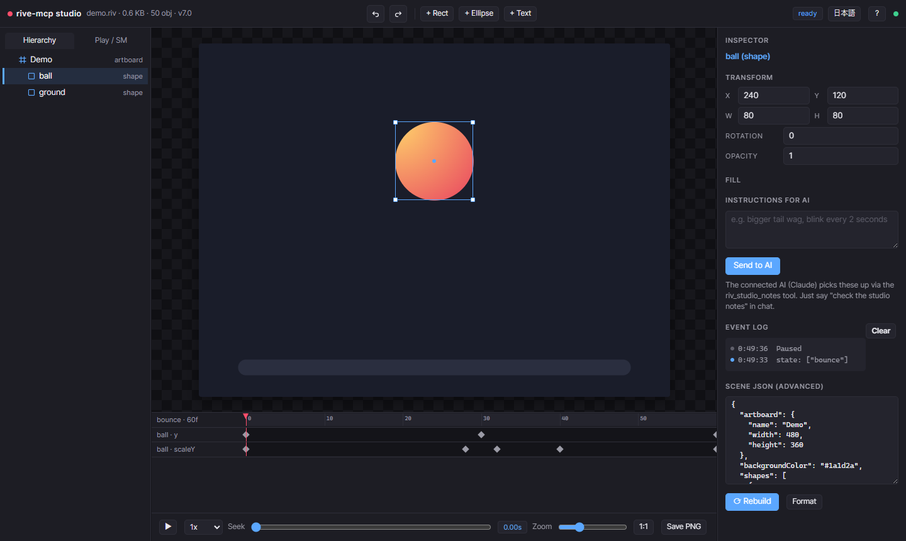
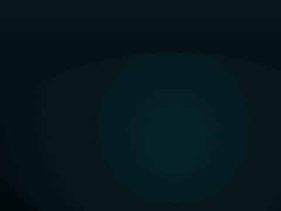
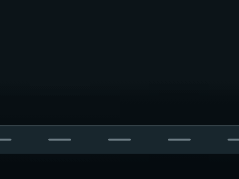
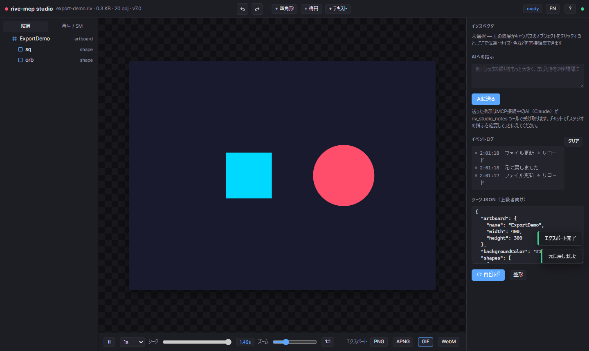

# rive-mcp

**Create, edit, inspect, render and live-preview Rive (`.riv`) animations from Claude — no Rive editor, no cloud, no subscription.**

[日本語 README はこちら](./README.ja.md)

rive-mcp is a free MCP (Model Context Protocol) server that gives Claude (or any MCP client) full control over `.riv` files. Unlike the official Rive MCP (which requires the editor running) or paid third-party servers, it works with nothing but a `.riv` file — and it can even **build `.riv` files from scratch** by serializing the binary format directly.

Rendering runs the **official Rive runtime** (`@rive-app/canvas-advanced` WASM) inside headless Chromium, so what you see is exactly what ships.



<p align="center"></p>
<p align="center"><i>This animation was generated entirely by <code>riv_create</code> — no Rive editor involved.</i></p>

## Highlights

- **Generate `.riv` from JSON** — shapes, gradients, embedded PNGs, text, bones + skinning, IK, mesh deformation, keyframe animation with easing, multi-layer state machines, listeners, events, physics baking, particles
- **Pro-quality by construction** — 21 semantic motion presets (`pop-in`, staggered `rise-in`, `breathing`, …) with professionally tuned amplitudes/easings, an OKLCH design-token generator (`riv_design_tokens`), motion-quality lint rules (robotic linear movement, teleports, missing stagger), and a one-call critique loop (`riv_critique`: frames + objective metrics + scoring checklist)
- **Real vector art pipeline** — import SVG (Figma/Illustrator/Iconify, or npm SVG sets like `@twemoji/svg` when offline) as true bezier paths (`riv_import_svg`, `riv_asset_search`), decompile existing `.riv` files into editable specs **including gradients, blend modes and hand-tuned animation tracks** (`riv_decompile`), plus trim paths (draw-on), clipping masks, blend modes (`multiply` shadows, `screen` glows), follow-path motion, solos and detached bezier handles in the scene spec
- **Losslessly edit existing `.riv`** — change any property, swap text, delete subtrees (references auto-remapped); round-trip verified pixel-perfect
- **Local web Studio** — Rive-editor-style 3-pane UI (hierarchy / canvas with click-select & drag / inspector / timeline) with hot reload; edits apply live
- **Human ⇄ AI loop** — an "Instructions for AI" box in the Studio: you type feedback, the AI picks it up via `riv_studio_notes` and fixes the file, your browser updates instantly
- **Auto-rig characters** — one call turns a character PNG into a rigged `.riv` with cutout parts, bone-skinned head mesh, eye blink, idle/happy animations and a state machine
- **Everything verified** — generated files are loaded, rendered and state-machine-driven by the official runtime in E2E tests

## Tools (27)

| Tool | What it does |
|---|---|
| `riv_list` | Recursively find `.riv` files (size, format version) |
| `riv_inspect` | Full metadata: artboards, animations (duration/fps/loop), state machines and inputs |
| `riv_lint` | Static diagnostic: broken references, oversized embedded assets, unreachable state-machine states, unconditional self-transitions (infinite-loop risk), unused inputs, easing silently discarded on a track's last keyframe, **motion-quality rules** (all-linear "robotic" movement, teleporting objects, missing stagger, one-sided scale) |
| `riv_render_frame` | Render any moment to PNG (inline image + file) |
| `riv_render_gif` | Turn an animation into a preview GIF |
| `riv_render_apng` | Animated PNG export — 24-bit color + alpha transparency (plays on GitHub) |
| `riv_render_video` | Record an animation or state machine to WebM video |
| `riv_render_sprites` | Sprite-sheet PNG + JSON metadata (for game engines) |
| `riv_play_state_machine` | Set/fire inputs → advance → state-transition report (+ optional frame captures) |
| `riv_generate_code` | Integration code with real artboard/SM/input names (React / JS / Vue / Svelte / Flutter) |
| `riv_create` | **Build a `.riv` from a JSON scene spec** — validated with the official runtime, returns a preview. Supports bezier-handled vertices, elastic easing, gradients, physics baking, particles, and **semantic motion presets** (`{"preset":"pop-in","target":"card"}` expands server-side into professionally tuned keyframes — entrances/exits/emphasis/ambient loops, with `stagger` for groups) |
| `riv_design_tokens` | **Generate design tokens before designing**: OKLCH-harmonized palette (+WCAG contrast), gradient pairs, Material-Motion durations & easing roles, spacing/radius/type scales — deterministic from seed color + mood |
| `riv_import_svg` | **SVG → Rive bezier shapes** (Figma/Illustrator exports, icons, illustrations): full cubic vertices, multi-contour paths, gradients, strokes, nested transforms — so the AI composes pro artwork instead of drawing with primitives. Fragments plug into riv_create via `imports` |
| `riv_asset_search` | Search **Iconify's ~200k professionally designed icons** and import one directly as Rive shapes (needs network) |
| `riv_lottie_import` | **Lottie/bodymovin JSON → Rive scene fragment** — pulls in LottieFiles' huge library of free professionally-animated assets art *and* choreography: keyframed transforms with exact bezier easing curves (not preset-approximated), shape/null/precomp layers, gradients, trim-path draw-on, visibility windows. Unsupported bits (text layers, masks, mattes, path morphing, …) are counted, not silently dropped |
| `riv_decompile` | **.riv → editable scene spec**: study or remix professional files (bezier paths, gradients, solos, trim paths, animations with named easings); unsupported types are counted, not silently dropped |
| `riv_critique` | **One-call review bundle that makes motion visible to a VLM**: a filmstrip (frames left→right), an onion-skin overlay (motion trails), a motion report (net displacement vector per animated object), objective metrics (bezier ratio, palette flags, easing distribution) + lint findings + a fixed 7-axis scoring checklist incl. spatial/directional coherence (does each mover travel toward its artwork's front? is the perspective consistent?) |
| `riv_edit` | Lossless editing of existing `.riv` files: set properties, swap named text, delete subtrees, **add/replace/remove keyframes** |
| `riv_extract_assets` | Extract embedded images/fonts from a `.riv` |
| `riv_visual_diff` | Pixel diff of two `.riv` files with a highlighted diff image |
| `riv_dump` | Low-level binary structure dump (typeKeys / properties / hierarchy) |
| `riv_slice_image` | Cut character parts out of a PNG by polygon (for cutout rigging) |
| `riv_rig_character` | **Character PNG → fully rigged `.riv` in one call** |
| `riv_diff` | Structural diff between two `.riv` files |
| `riv_studio` | **Local web Studio**: Rive-editor-style dark UI — hierarchy tree, canvas select/drag/resize, inspector, keyframe timeline editing, undo/redo, playback speed, one-click export (PNG/APNG/GIF/WebM), live preview + hot reload, EN/JA |
| `riv_studio_notes` | Fetch instructions the human typed into the Studio UI |
| `riv_setup` | **One-call environment setup**: installs the bundled `rive-design-guidelines` skill into `.claude/skills/` (project) or `~/.claude/skills/` (user) so the pro workflow auto-triggers — confirmation happens via the normal tool-permission prompt |

### Showcases: professional assets in, professional motion out

Three sample scenes are built end-to-end by the pipeline, each rebuildable with `node samples/<name>/build-scene.mjs`:

- [`samples/cosmic-journey/`](samples/cosmic-journey/) — **every piece of artwork is professionally designed** (Twemoji rocket, ringed planet, moon, stars, comet — fetched as SVG via npm and converted with `riv_import_svg`); colors from `riv_design_tokens`, motion from presets, composition fixed through the `riv_critique` loop.
- [`samples/night-delivery/`](samples/night-delivery/) — **remixes a professional `.riv`**: Rive's official truck (hand-drawn bezier art *and* its hand-tuned wheel/body animation tracks) is extracted with `riv_decompile` and composed into a new night scene with a Twemoji moon, scrolling road and a `screen`-blended headlight beam.
- [`samples/launch-success/`](samples/launch-success/) — hand-authored SVG + tokens + presets + TrimPath draw-on + particles + intro→idle state machine.

<p align="center"><br></p>

Twemoji artwork © Twitter/X and contributors, [CC-BY 4.0](https://creativecommons.org/licenses/by/4.0/); truck artwork from Rive's official example files.

### Design quality guidance

`riv_create` output can look like flat "AI placeholder" shapes if a client just wings the scene spec. The server bakes quality in structurally — the recommended flow for any non-trivial scene is:

1. `riv_design_tokens` → use only the returned palette/gradients/durations/easings (never invent raw hex or ad-hoc timings)
2. `riv_create` with motion `presets` instead of hand-authored keyframes wherever one fits
3. `riv_critique` → look at the frames, score the 6-axis checklist, fix anything below 4, re-run (at least twice)

The same workflow plus hand-authoring craft rules (bezier curves, easing semantics, rigging) is exposed as the `rive-design-guidelines` MCP prompt. For clients without MCP prompts support, it ships as a portable skill file at [`skills/rive-design-guidelines/SKILL.md`](skills/rive-design-guidelines/SKILL.md).

## Quick start

Install from npm:

```bash
npm install -g rive-mcp-server

# Register with Claude Code (user scope = available in every project)
claude mcp add --scope user rive -- rive-mcp
```

Or run from source:

```bash
git clone https://github.com/ODU33104/rive-mcp.git
cd rive-mcp
npm install
npm run build
claude mcp add --scope user rive -- node /absolute/path/to/rive-mcp/dist/index.js
```

A Chromium-based browser is auto-detected in this order (usually nothing to install):

1. `RIVE_MCP_CHROME` env var (path to Chrome/Edge executable)
2. Playwright browser cache
3. Installed Chrome → Edge

Requires Node.js 20+.

## The Studio: human ⇄ AI collaboration

`riv_studio` opens a local web page where a human can inspect, directly edit, and request changes to whatever the AI built (first-run guide included, UI in English/Japanese):

1. **Let the AI build** — "create a bouncing-ball riv and open it with riv_studio"
2. **Touch it** — click/drag objects on the canvas, tweak numbers & colors in the inspector (applies live)
3. **Ask the AI** — type bigger changes into *Instructions for AI*, then say "check the studio notes" in chat
4. When the AI edits the file, the browser hot-reloads instantly

Works without a scene JSON too: any `.riv` can be edited property-by-property through the hierarchy + inspector.

## One-click export

Click PNG / APNG / GIF / WebM in the Studio toolbar to render the current animation on the spot — no MCP round-trip needed for a quick preview export.



## Character animation

Turn a single character PNG into a naturally moving `.riv`:

- `riv_slice_image` cuts out ears/tail/etc. by polygon, `riv_rig_character` assembles the whole rig in one call: pivot groups, a seamless 2-bone head mesh for tilting, vector eyelid blink, idle/happy animations and a `happy` trigger
- Or compose manually with `riv_create`: image embedding, grid meshes with per-vertex keyframes, bone chains with distance-weighted skinning, IK constraints

## Example prompts

- "List the riv files in `samples/` and inspect vehicles.riv"
- "Render the `curves` animation as a GIF"
- "Create a riv of falling snow over a night sky and open it in the studio"
- "Rig `characters/cat.png` — ears and tail should move, and it should look happy on click"
- "Check the studio notes" *(after typing feedback into the Studio UI)*
- "Write the React integration code for this file"

## Development

```bash
npm run build      # vendor runtime assets + tsc
npm run test:e2e   # spawns the real server, exercises all 18 tools over JSON-RPC (48 checks)
```

`docs/riv-format.md` documents the reverse-engineered knowledge of the `.riv` binary format used by the writer (typeKeys/propertyKeys resolved from the official `rive-runtime` type definitions vendored in `vendor/rive-defs/defs.json`).

## Limitations

- Text-run enumeration is not exposed by the runtime API (access by name works)
- GIF output has no transparency (composited on a background color)
- The Canvas2D preview renderer can show mesh seams that don't exist in the file (WebGL/Skia render clean)
- `fill.feather`/`stroke.feather` (vector blur) writes correctly to the `.riv` but isn't rendered by this server's Canvas2D preview pipeline — only a GPU Rive Renderer supports it
- Luau scripting and the Layout engine are not generated (runtime spec still moving)

## License

**Free to use** (personal & commercial) — but **not open source**. This is source-available freeware:

- ✅ Use the software freely; the `.riv` files and code it generates are yours without restriction
- ❌ No modification, no redistribution, no derivative works
- ❌ No reverse engineering; no AI-assisted analysis, extraction or reproduction of the code (including use as training data)

See [LICENSE](./LICENSE) for the exact terms. Bundled third-party components: Inter font (OFL 1.1), Rive runtime & type definitions (MIT, © Rive, Inc.).

*rive-mcp is an unofficial tool and is not affiliated with or endorsed by Rive, Inc.*
