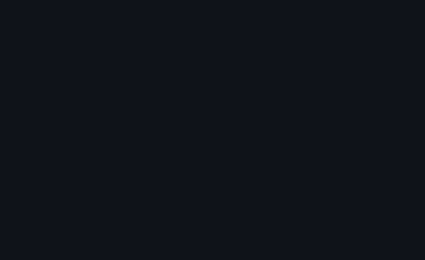

# Screenshot → animated prototype

Two calls turn a UI screenshot into a working `.riv`:

```
riv_ui_detect     imagePath, overlayPath   → element tree + numbered overlay
riv_ui_prototype  imagePath, outPath, roles → .riv
```

`riv_ui_detect` returns geometry and nothing else — it finds rectangles, text runs
and pictures, and has no idea which of them is a button. Look at the overlay,
decide what each numbered element is, and send the ids back as roles.
`riv_ui_prototype` re-runs the same detection, so pass it the same `minArea` and
`maxElements`, or the ids will not line up; it says so in its warnings when they
do not.

Each element becomes either a vector rectangle or a slice of the original image.
Roles pick the entrance, and cards and buttons get hover and press states.

## What each field means

`renderMode` is how an element will be rebuilt — `vector-panel` for a flat
rectangle with a fill and a corner radius, `raster` for a crop of the screenshot.
`semanticHint` is what it looks like: `panel`, `text`, `image` or `line`. The two
are separate on purpose. Getting the rendering wrong changes what the prototype
looks like; getting the label wrong only changes which entrance it gets.

`matteEligible` says whether a text run could be cut away from its background with
real transparency. `matteConfidence` grades how well that worked.

## Rectangles are estimates, not measurements

Detection runs on a downscaled copy — anything above 1280px on its long side is
reduced, analysed, and the results scaled back. Coordinates come back in the
original resolution but they are recovered, not measured. Expect a pixel or two.

Corner radii are inferred by probing diagonally into each corner, and carry a
relative error of roughly 10–17%: a 12px radius reads back somewhere between 10
and 14.

## Known limitations

**Small changes to the image change the result a lot.** Colour is quantised into
5-bit buckets with no hysteresis, so 127 and 129 fall on opposite sides of a
boundary. Re-encoding a PNG losslessly changes nothing at all, but perturbing
every pixel by ±2 — less than a JPEG round trip, less than the gap between two
renderers — reclassifies about six vector panels in seven and can nearly triple
the element count. Measured across six real pages:

| change | classifications unchanged | element count |
|---|---|---|
| PNG re-encode | 100% | 1.00x |
| 1px pad / crop | 71% / 59% | 1.05x |
| JPEG q95 | 49% | up to 1.57x |
| 0.75x / 1.25x resize | 39% / 51% | 1.03x / 1.10x |
| RGB ±2 | 15% | up to 2.73x |

Feed it the original file rather than a screenshot of a screenshot, and expect a
different element tree if you re-export at another size.

**A panel with a label in it is often classified as a picture.** Whether
something can be rebuilt as a vector rectangle is decided by how much of its
bounding box the shape fills, and text punches holes: a button with a caption can
drop under the threshold and come back as a crop. It is still found — geometry
recall is 1.0 across every page tested, at IoU 0.8 or better — but it arrives as
an image rather than an editable rectangle. On a dark GitHub page this leaves no
vector panels at all among a hundred and twenty elements.

**Touching areas of the same colour cannot be separated.** Two cards of identical
fill with no gap between them are one connected region, and there is no boundary
in the picture to find. The same is true of a panel whose colour is within one
quantisation bucket of what surrounds it.

**Text lines are coarse.** Runs are grouped by proximity, and a gap left by a
letter that the quantiser swallowed looks exactly like the space between two
words. It errs toward joining: a label and its value can end up as one run rather
than a word being split down the middle. The pixels are identical either way —
what differs is what moves independently.

**Text that cannot be cut out only fades.** A rectangular crop carries its
background, and the bottom layer of the prototype is the original screenshot, so
moving such a crop shows the same pixels in two places. Elements without a matte
therefore fade in place, lose their looping idle, and get no hover or press. The
warnings say how many were restricted. 88% of real text runs get a matte; the
rest stay legible and static.

**Some flat parts of photographs get matted anyway.** Of six picture regions that
qualified across twelve pages, four turned out to be text sitting on top of an
image — a caption and two glyphs — and two were genuinely photographic: flat
patches of open water, which really are two-tone. So roughly 5% of picture regions
fit the model as well as text does. Neither confidence nor shape separates them:
those two scored 0.93 and 0.96, above every real text line measured, and their
crops are 55x11 and 77x10, exactly the shape of a line of text. Being flat to
begin with, matting them reproduces them accurately where they sit.

**Text rectangles are grown to reach the ink.** A line's box starts as the union
of surviving glyph fragments, and quantisation swallows round letters whole, so a
word can begin or end outside its own box — "Analytics" was detected from the "n"
onward and cropped to "nalvtics". The box is therefore extended outward, up to
1.6x the line height, for as long as pixels closer to the foreground than the
background keep appearing. That took text ink covered by an opaque fill from
16% down to 1%.

**Gradients become one picture, not thirty.** A band is detected as many flat
strips, and adjacent strips whose colour steps slowly are folded back into a
single raster. What stops this from swallowing a row of cards is the colour in the
gaps: a gradient's gap holds the shade that was dropped, a card's margin holds the
page behind it.

## Demo



A dashboard drawn for this repository, detected and turned into a prototype with
no hand-authored geometry: 26 elements, 14 of them rebuilt as vector rectangles,
the rest as image slices. Three elements had no usable matte and fade in place
rather than moving, which the tool reports.

## Checking it yourself

```
node test/uiDetect.mjs        # detection, the boundary gate, stripe merging, mattes
node test/uiPrototype.mjs     # roles, motion restrictions
node test/detectorMetrics.mjs # the measurement harness itself
node test/releaseGate.mjs     # real pages + transformation stability
```

`test/fixtures/gateSweep.mjs` and `test/fixtures/stripeSweep.mjs` re-derive the
thresholds. Every number in this file came out of one of these.

Real screenshots are not in this repository — redistributing other people's pixels
is not something a fixture needs to do. `test/fixtures/captureReal.mjs` rebuilds
them, and `RIVE_UI_FIXTURES` points the whole pipeline at your own directory.
